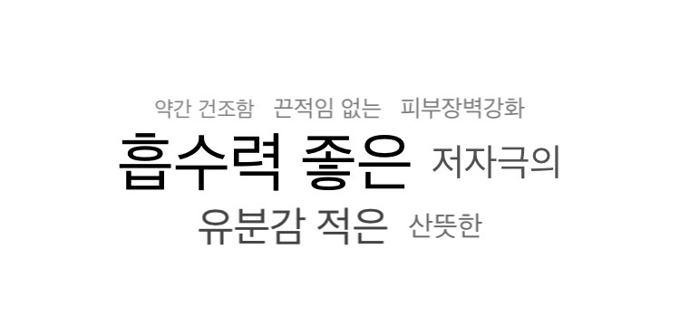

# WordCloudCollectionView
Horizontally and vertically centered view having proportionate font size and alpha value of the cells

 
## Intoduction

This is a collection view which get the list of words and frequency of each as input and layouts the word cloud view of the list.You can change the maximum and minimum font size and alpha value to customize the look. It calculates the font size of the each labels using the linear function that crosses (minimum frequency, minimum font size) and (maximum frequency, maximum frequency, and it's same for the alpha value calculation.

It shuffles the order of the list of input, and insert the element of maximum frequency at the middle index.

And it deploys CenterAlignedCollectionViewFlowLayout which is horizontally, vertically center aligned collection view vertical layout



## Example of the input

[
{
"sentence": "끈적임 없는",
"frequency": 9
},
{
"sentence": "저자극의",
"frequency": 40
},
{
"sentence": "흡수력 좋은",
"frequency": 100
},
{
"sentence": "산뜻한",
"frequency": 20
},
{
"sentence": "유분감 적은",
"frequency": 50
},
{
"sentence": "약간 건조함",
"frequency": 5
},
{
"sentence": "피부장벽강화",
"frequency": 10
}
]

## Requirements

`WordCloudCollectionView` is written in Swift 4.

## Usage

1. modify the topicString constant

```swift
let topicString = 
```

2. change the value as you want

```swift
let maxFontSize:CGFloat = 36
            let minFontSize:CGFloat = 12
            let maxAlpha:CGFloat = 1
            let minAlpha:CGFloat = 0.5
```

## Author

Jihyun, jihyuns1217@gmail.com


